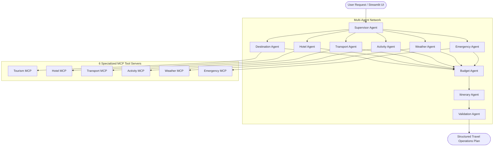

# CeylonTrip AI — AI Travel Operations System for Sri Lanka

**CeylonTrip AI** is a production-style, multi-agent AI travel operations system designed **exclusively for Sri Lanka**.

It is built with **Python 3.11+**, **LangChain**, **LangGraph**, **Groq API**, **Model Context Protocol (MCP)**, and **Streamlit**.

---

## 🌟 Core Highlights & Architectural Principles

* **Strictly No Database**: Zero persistent databases (No PostgreSQL, MySQL, SQLite, MongoDB, Redis, vector DBs, ChromaDB, FAISS, or local dataset files).
* **Online-First Architecture**: Fetches live travel information dynamically at runtime using 6 specialized MCP servers querying external APIs (Open-Meteo, OpenStreetMap/Nominatim, OSRM, Overpass API, Wikipedia).
* **Direct Multi-Agent Execution**: Streamlit UI invokes the underlying LangGraph agent workflow directly without external web API overhead.
* **Sri Lanka Exclusivity & LKR Currency**: Rejects requests outside Sri Lanka dynamically via geocoding validation. All budgets and cost estimates operate strictly in Sri Lankan Rupees (LKR).
* **Deterministic Budget Engine**: Python arithmetic computes costs in LKR with 100% precision. Every cost item includes explicit `source` and `status` (`verified` or `estimated`).
* **Source Transparency**: Full visibility into external data sources, retrieval timestamps, and MCP tool execution logs.

---

## 🏗️ Architecture Blueprint



---

## 🧰 Tech Stack

* **Orchestration**: LangGraph, LangChain (`langchain-core`, `langchain-community`)
* **LLM**: Groq API (`langchain-groq`)
* **Tool Layer**: Model Context Protocol (MCP) — 6 Specialized Servers
* **Backend & UI**: Streamlit (Glassmorphic UI, Interactive Maps, Direct Agent Workflow Monitor)

---

## 🧰 The 6 MCP Servers

1. **Tourism MCP** (`mcp_servers/tourism_mcp/`): Geocoding via Nominatim & Wikipedia details.
2. **Hotel MCP** (`mcp_servers/hotel_mcp/`): External hotel search provider with explicit unavailable messaging when credentials are omitted.
3. **Transport MCP** (`mcp_servers/transport_mcp/`): Route distance & driving duration via live OSRM API, with Sri Lanka train/bus/tuk-tuk cost rates.
4. **Activity MCP** (`mcp_servers/activity_mcp/`): Overpass API attraction search & Sri Lanka experiences.
5. **Weather MCP** (`mcp_servers/weather_mcp/`): Real-time weather and 7-day forecast via Open-Meteo REST API.
6. **Emergency MCP** (`mcp_servers/emergency_mcp/`): Overpass API hospital & police locator + Sri Lanka 24/7 emergency hotlines (119 Police, 1990 Suwa Seriya Ambulance, 1912 Tourist Police).

---

## 🚀 Quick Start Guide

### 1. Prerequisites
- Python 3.11+ installed.

### 2. Environment Setup

Clone the repository and install dependencies:

```bash
pip install -r requirements.txt
```

Create `.env` file:

```bash
cp .env.example .env
```

Add your `GROQ_API_KEY` in `.env`:

```env
GROQ_API_KEY=your_groq_api_key_here
```

---

### 3. Running Streamlit Application

Launch the interactive Streamlit user interface:

```bash
streamlit run app.py
```

Open `http://localhost:8501` in your browser.
